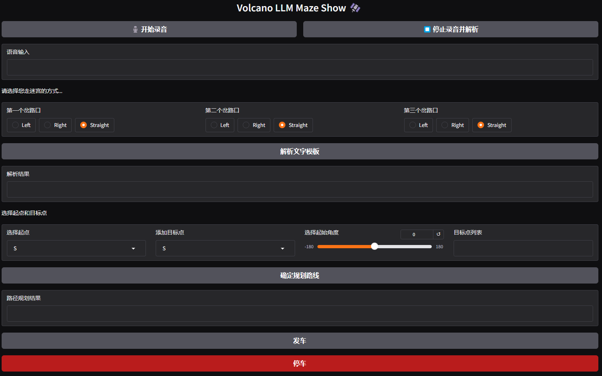
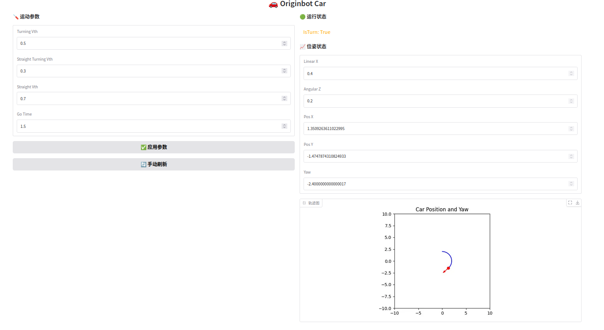

# 小车控制项目概述

本项目包含三个主要部分，共同实现小车的控制和运行：

- **dev_front**: 提供前端交互界面，用户可以通过该界面与小车进行交互。
- **PC_front**: 用于控制调参和小车控制，是小车的控制中心。
- **line_follower_maze**: 封装了小车运行的节点，负责小车在迷宫中的自主导航。

## 项目结构

```
line_follower_maze/ # 小车运行节点封装
dev_front/          # 前端交互
PC_front/           # 控制调参和小车控制
README.md           # 项目概述
```

## 快速开始

请按照以下步骤快速了解和使用本项目：

1.  **安装依赖**: requiremnets.txt 为本项目前端部分所需的所有环境依赖，使用$ pip install -r requirements.txt进行下载
2.  **配置环境**: 建议将line_follower_perception直接替换/userdata/dev_ws/src/originbot/originbot_deeplearning下的line_follower_perception文件，主要变更为 1、\src\line_follower_maze.cpp 2、\launch\line_follower_maze.launch.py 3、\include\line_follower_perception\line_follower_perception.h，更换后在userdata/dev_ws 目录下执行colcon build 并重新 source install/setup.bash
3.  **运行项目**: 首先执行dev_front下的 main.py后再执行小车运行节点, 最后再运行PC_front的 car_status.py

## 贡献

欢迎参与本项目的开发和改进！请参考各个子项目的 README 文件中的贡献指南。


# dev_front

## 项目名称

dev\_front - 用户端交互界面

## 项目描述

dev\_front 项目提供前端交互界面，用户可以通过该界面与小车进行交互，完成小车运动流程控制。

## 运行效果


## 介绍
dev_front主要分为三个模块，分别是语音输入模块、单路路径选择和多目标路径规划
语音输入模块依赖 dev_front/frontend/ASR.py 及 dev_front/frontend/utils.py 模块
单路路径模块依赖 dev_front/frontend/utils.py 模块
多目标路径规划依赖 dev_front/frontend/Autodriver.py 模块

# PC_front

## 项目名称

PC_front - 控制调参和小车控制

## 项目描述

PC_front 项目用于控制调参和小车可视化展示，为实验者提供简便的调参接口。

## 运行效果


## 介绍
PC_front主要分为两个模块，分别是参数调控和运行状态模块
参数调控通过封装line_follower_perception_node的参数调控接口来实现参数调整，因此须先开启line_follower_perception_node节点
可通过手动刷新来获取当前参数，并通过调整参数后通过应用参数按钮来实现参数的更新
运行状态模块通过订阅/cmd_vel、/stop_car、/odom 话题来获取小车的运行参数并绘制出轨迹图

# line_follower_maze

## 项目名称

line_follower_maze - 小车运行节点封装

## 项目描述

line_follower_maze 项目封装了小车运行的节点，负责小车在迷宫中的自主导航的运动控制。

## 使用说明

1. 运行小车导航节点:
    $ ros2 launch line_follower_perception line_follower_maze.launch.py
   
2. 主要变更：
   将所有需调试的参数修改为参数类型暴露出接口，以便外部进行参数调整
   增加了stop回调函数，满足小车的停车需求
